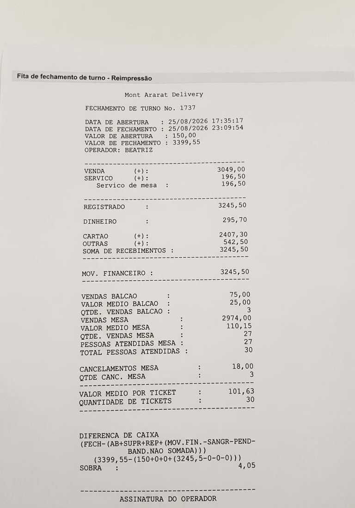
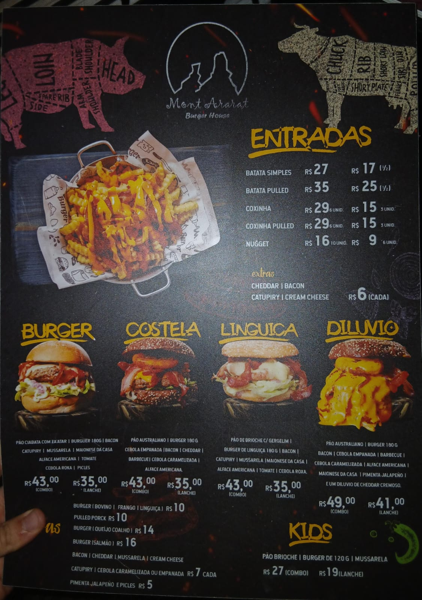
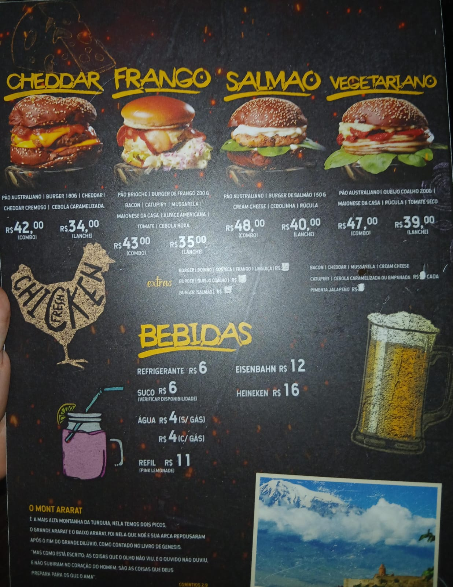
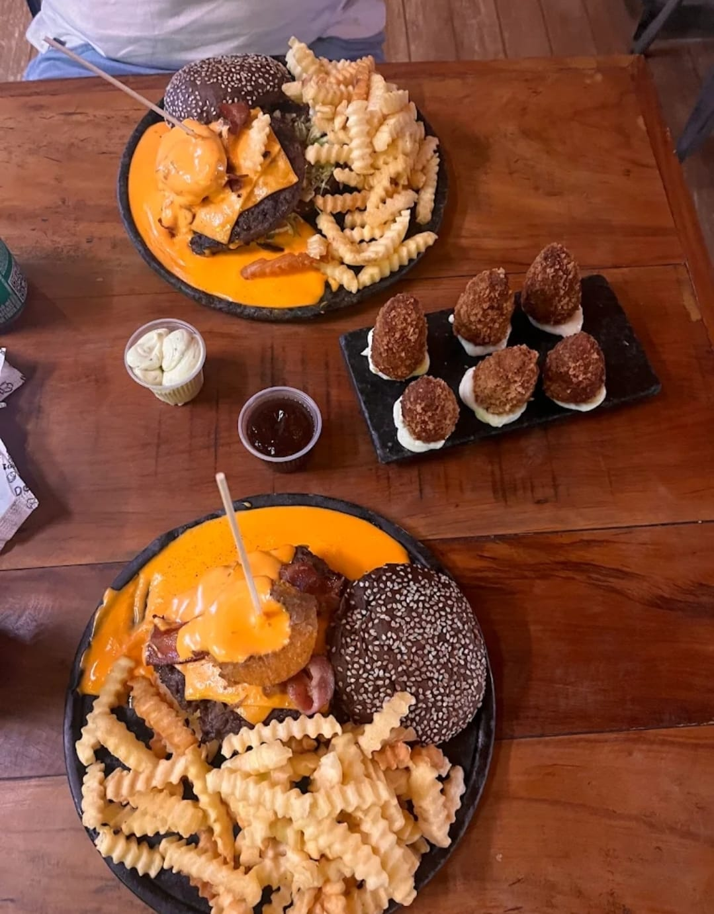
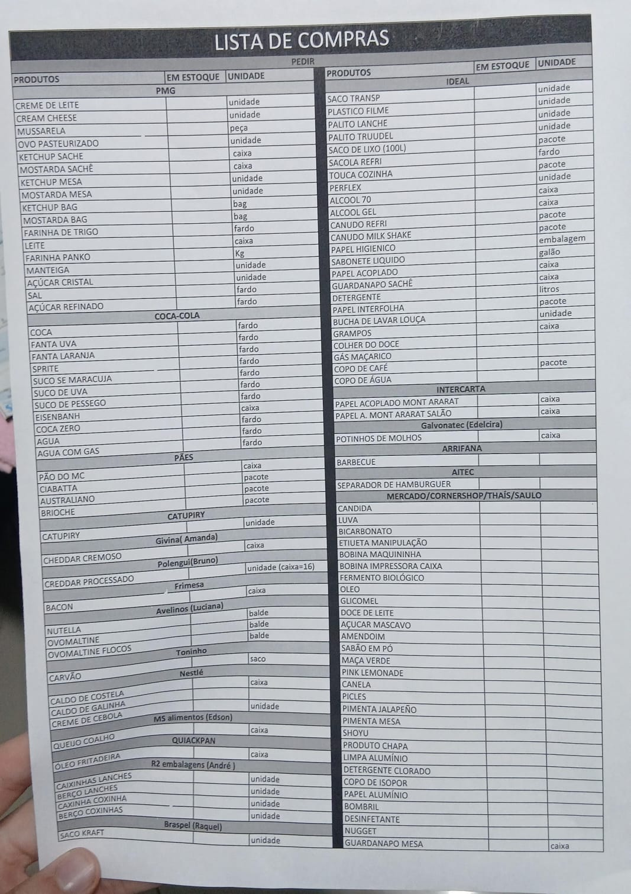
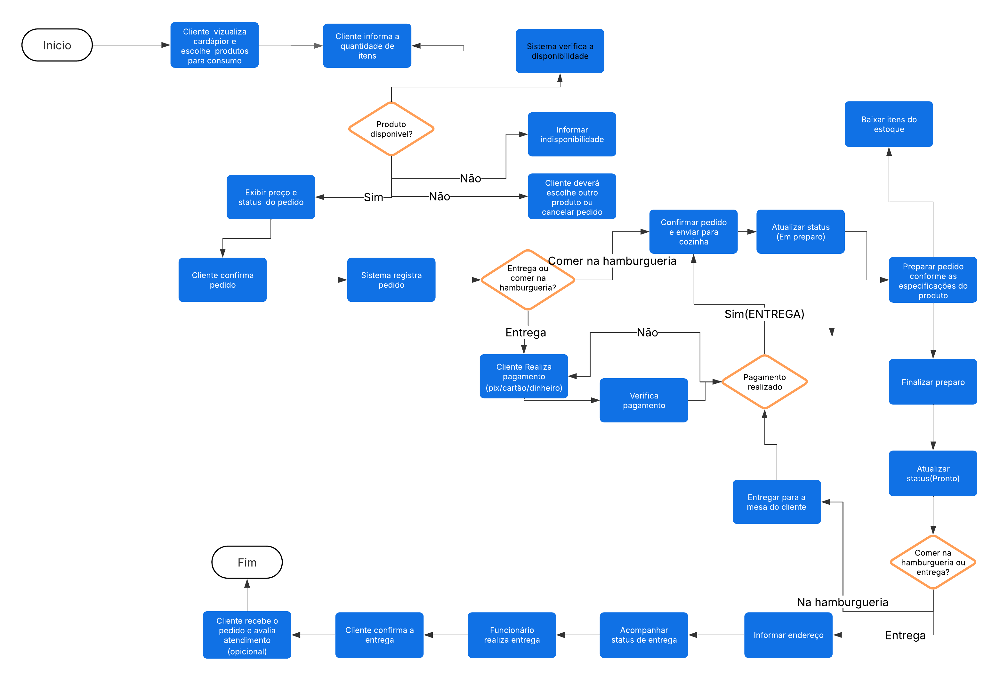

# Modelagem-DER-Montararat
Este repositório tem como objetivo apresentar e documentar a modelagem do banco de dados desenvolvido para a Hamburgueria MontArarat.

# MONTARARAT – BANCO DE DADOS
### Documentação de requisitos e modelo conceitual (primeira entrega)
---
**Integrantes do Grupo (Nomes e RGMs):**
* **Anna Luiza Ferreira Costa** | RGM: 48186198
* **Bruno da Silva Nascimento** | RGM: 48078883
* **Diogo de Castro Moreira** | RGM: 47629045
* **Guilherme Souza do Carmo** | RGM: 47856424
* **Henrique Santos Brunheiro** | RGM: 48071439
* **Kauan Ferreira da Silva Luiz** | RGM: 47728035
* **Maria Eduarda Lima Pereira** | RGM: 48049018
* **Matheus Victoriano Pires Barbosa** | RGM: 47387980
* **Nicole Alejandra Apaza Mamani** | RGM: 47259701
* **Vinícius Nogueira Martins** | RGM: 47697318
* **Yasmin Gonçalves Pucci Salem** | RGM: 48259357
---
## 1. SOBRE A EMPRESA
A empresa selecionada pelo grupo foi o **Montararat**, uma hamburgueria localizada na zona leste de São Paulo, no bairro de São Mateus. Focada no comércio de lanches e porções, a hamburgueria tem como seus principais clientes os moradores da região, que frequentam o estabelecimento físico ou pedem via delivery. Seus principais setores são:
* **Atendimento ao cliente:** Formado pelo(a) atendente do balcão e garçons, atuam na recepção de clientes, consulta ao cardápio, recepção e lançamento de pedidos (presenciais e retirada), atendimento das mesas e entrega de pedidos.
* **Operações / Produção (Cozinha):** A equipe da cozinha (chapeiros, cozinheiros, auxiliares) age na produção dos hambúrgueres e acompanhamentos, controle de fila e tempo dos pedidos na chapa, montagem dos pratos e solicitação de reposição de insumos.
* **Financeiro:** O(a) atendente do balcão e o(a) gerente são responsáveis pelo fechamento do caixa, recebimento de pagamentos (PIX, Cartão, Dinheiro) e pela emissão de comprovantes.
* **Gestão e Administração:** O(a) gerente lidera esse setor na supervisão geral do funcionamento do salão e da cozinha, gerenciamento de estoque, escala da equipe, relatório de vendas, controle financeiro geral e autorizações especiais (como cancelamento de pedido ou descontos).
* **Estoque e Compras:** Nesse setor, o(a) gerente e a equipe da cozinha realizam a conferência de insumos (pães, carnes, queijos, bebidas), registro de entrada/saída de produtos, identificação de itens em falta e pedido de compra com o fornecedor.
**Horários de funcionamento:**
* Terça à Quinta (18h – 23h)
* Sexta e Sábado (18h – 00h)
* Domingo (18h – 23h)
---
## 2. CONTEXTUALIZAÇÃO E MOTIVAÇÃO
A escolha da hamburgueria Mont Ararat como objeto desse estudo se dá por ser uma empresa próxima da região, somada a um alto volume de vendas e um gerenciamento pouco organizado, gerando um conjunto de motivos favoráveis para a agregação de um ERP ao sistema da empresa.

*(Evidência 1) - Relatório impresso de fechamento de caixa, em um dia moderadamente movimentado, operado no terminal de delivery.*
---
## 3. PROCESSOS DE NEGÓCIO
Em geral, o processo operacional padrão que engloba o funcionamento da empresa segue dois fluxos principais, que variam de acordo com o local de consumo (presencial ou delivery):
### 3.1 PRESENCIAL
`Cliente` ➔ `Atendimento e Pedido` ➔ `Produção` ➔ `Entrega e Consumo` ➔ `Pagamento`
### 3.2 DELIVERY
`Cliente` ➔ `Atendimento e Pedido` ➔ `Pagamento` ➔ `Produção` ➔ `Entrega e Consumo`
### 3.3 DETALHAMENTO DAS ETAPAS
* **Cliente:** Entrada do cliente no estabelecimento ou acesso às plataformas digitais de atendimento/delivery (iFood / 99food).
* **Atendimento e Pedido:** Recepção da solicitação do cliente, escolha dos itens do menu, registro das preferências/observações e envio do pedido para o sistema.
* **Pagamento:** Realização e validação da transação financeira (PIX, Cartão ou Dinheiro). No fluxo DELIVERY, essa etapa antecede a produção; no fluxo PRESENCIAL, ela ocorre após o consumo.
* **Produção:** Recebimento da comanda pela cozinha, preparo dos hambúrgueres e acompanhamentos na chapa, montagem e embalagem.
* **Entrega e Consumo:** No fluxo DELIVERY, o pedido já embalado é repassado ao entregador (motoboy) para realização da entrega no endereço solicitado pelo cliente. No fluxo PRESENCIAL, o pedido é entregue na mesa do cliente, servido para ser consumido no local.

*(Evidência 2) - Foto do cardápio da hamburgueria, com imagens dos hambúrgueres, bebidas, descrições e preços.*

*(Evidência 3) – Dois Dilúvios, lanche especial da casa, servidos em uma mesa, acompanhados de uma porção de coxinhas crocantes.*
---
## 4. PROBLEMAS E NECESSIDADES
A partir do estudo de caso do Mont Ararat, identificou-se que a principal fragilidade operacional se encontra na gestão e controle de estoque/suprimentos, que atualmente carece de organização e estruturação em Banco de Dados.

*(Evidência 4) – Lista de compras, contendo o estoque, onde os produtos são separados por categorias, marcas e necessidades.*

| Problema Identificado | Consequência para o Negócio |
| :--- | :--- |
| **Itens sem organização em ordem alfabética** | Lentidão e dificuldade na localização rápida de insumos. |
| **Fragmentação de itens de mesma categoria** | Desorganização no inventário e duplicidade acidental no cadastro de compras. |
| **Nomenclaturas de categorias confusas ou genéricas** | Dificuldade na filtragem de produtos e falhas na busca do sistema. |
| **Controle de estoque manual/informal** | Divergência de saldos, perdas e erros no levantamento de quantidades. |

---
## 5. REQUISITOS FUNCIONAIS (RF)

| Identificador | Descrição |
| :--- | :--- |
| **RF01** | Os funcionários devem conseguir visualizar, gerenciar e atender aos pedidos e solicitações dos clientes no sistema; |
| **RF02** | O sistema deve conter diferentes formas de pagamento (pix / cartão / dinheiro); |
| **RF03** | Os clientes devem conseguir escolher a quantidade de itens (hambúrgueres, bebidas, acompanhamentos) a ser comprada; |
| **RF04** | Os funcionários devem conseguir realizar o cadastro e controle de insumos/produtos para o estoque; |
| **RF05** | O sistema deve gerar relatórios semanais de desempenho para que a equipe analise a produtividade e o volume de vendas; |
| **RF06** | Os líderes/gerentes devem possuir um dashboard com a análise de desempenho da hamburgueria (faturamento, pratos mais vendidos, tempo médio de preparo); |
| **RF07** | Os clientes devem ser capazes de identificar as mesas disponíveis para atendimento do local; |
| **RF08** | Os clientes devem saber o tempo estimado de preparo do pedido; |
| **RF09** | Os clientes devem possuir acesso às especificações do produto (ingredientes / peso do hambúrguer); |
| **RF10** | Os clientes devem ter acesso a um canal/módulo de avaliação e reclamações sobre o pedido; |
| **RF11** | Os clientes devem poder escolher o método de entrega do seu pedido (delivery ou retirada no balcão/local). |

---
## 6. REQUISITOS NÃO FUNCIONAIS (RNF)

| Identificador | Descrição |
| :--- | :--- |
| **RNF01** | O backup dos dados do cliente deve ser realizado diariamente; |
| **RNF02** | Os favoritos devem estar listados conforme a data, do mais recente ao mais antigo item salvo; |
| **RNF03** | O tempo de resposta para o lançamento de pedidos e impressão/envio para a cozinha não deve exceder 2 segundos em pico operacional; |
| **RNF04** | O sistema deve gerar o comprovante do pedido em no máximo 5 segundos, após a confirmação do pagamento; |
| **RNF05** | O carrinho deve listar os itens de acordo com a ordem do pedido; |
| **RNF06** | O módulo de contato deve manter uma disponibilidade de no mínimo 99% do tempo. |

---
## 7. REGRAS DE NEGÓCIO (RDN)

| Identificador | Descrição |
| :--- | :--- |
| **RDN01** | O pedido só pode entrar em produção após a confirmação do pagamento, salvo em situações de consumo no estabelecimento; |
| **RDN02** | A reserva das mesas só podem ser feitas de forma presencial de acordo com a disponibilidade; |
| **RDN03** | A limpeza das mesas só podem ser realizadas após a utilização; |
| **RDN04** | O produto só pode ser vendido mediante sua disponibilidade; |
| **RDN05** | Em caso de insatisfação, pode ser realizada a troca do produto ou o cancelamento do mesmo; |
| **RDN06** | Produtos de montagem especial não podem ser enviados via delivery; |
| **RDN07** | Cada produto deve ser embalado individualmente com identificações em suas determinadas embalagens; |
| **RDN08** | A retirada dos pedidos para delivery deve ser feita na porta do estabelecimento. |
---
## 8. RESTRIÇÕES E POLÍTICAS ORGANIZACIONAIS
Assim como todas as empresas, o Mont Ararat possui suas regras e políticas internas a serem cumpridas:
* **Cozinha:** Somente funcionários e pessoas autorizadas podem entrar na cozinha do estabelecimento, garantindo a privacidade e segurança dos clientes e funcionários.
* **Compra / Reposição:** O(a) gerente é a única pessoa (exceto o proprietário) que pode realizar a compra de insumos com os fornecedores para o estoque da hamburgueria.
* **Promoções de Aniversário:** O cliente só pode usufruir da promoção de aniversário mediante apresentação de um documento pessoal que comprove a data de nascimento (RG, CNH, etc.).
* **Cancelamento / Troca:** Em caso de insatisfação, o cliente tem direito à solicitação de troca/reembolso do seu pedido apenas se não houve consumo.
* **Venda do Produto:** Para que não haja desentendimentos, é imprescindível que o estoque seja previamente checado antes da comercialização de um produto.
* **Prioridade dos pedidos:** Pedidos feitos no estabelecimento devem, em todas as circunstâncias, ter prioridade de produção, permitindo um atendimento rápido para os consumidores no local.
---
## 9. FLUXOGRAMA
Abaixo, um fluxograma do funcionamento do banco de dados da hamburgueria, construído com o Lucidchart, uma ferramenta muito útil para produção de fluxogramas:

---
## 10. DER (DIAGRAMA DE ENTIDADE - RELACIONAMENTO)
Abaixo, segue a modelagem do digrama entidades produzido

## 11. DICIONÁRIO DE DADOS (MODELO CONCEITUAL)
### ENTIDADE: Pessoa

| Atributo | Descrição | Regra / Observação |
| :--- | :--- | :--- |
| **cpf (PK)** | Número do CPF que identifica a Pessoa. | Deve ser único para cada pessoa. |
| **nome** | Nome completo da pessoa. | Preenchimento obrigatório. Não precisa ser único. |
| **telefone** | Número de telefone/celular para contato. | Conter apenas números. Formato com DDD. |
| **email** | Endereço de e-mail para contato. | Deve ser válido (ex: usuario@gmail.com). |
| **endereco** | Local de residência da pessoa. | Endereço completo (rua, número e CEP). |

### ENTIDADE: Funcionario

| Atributo | Descrição | Regra / Observação |
| :--- | :--- | :--- |
| **id_funcionario (PK)** | Identificador do Funcionário. | Deve ser único para cada funcionário. |
| **cpf (FK)** | Número do CPF que identifica o funcionário. | Deve ser único para cada funcionário. |
| **nome** | Nome completo do funcionário. | Preenchimento obrigatório. |
| **cargo** | Cargo do funcionário dentro da empresa. | Não precisa ser único. |
| **salario** | Remuneração mensal do funcionário. | Deve conter o valor bruto. |
| **setor** | Setor do funcionário dentro da empresa. | Não precisa ser único. |
| **data_admissao** | Data de admissão pela empresa. | Formato completo (DD/MM/AAAA). |

### ENTIDADE: Pedido

| Atributo | Descrição | Regra / Observação |
| :--- | :--- | :--- |
| **id_pedido (PK)** | Identificador do Pedido. | Identificação única. |
| **data** | Data que o pedido foi efetivado. | Deve corresponder à data de realização do pedido. |
| **status_pedido** | Mostra o status do pedido. | Deve representar o estado no atendimento. |
| **cpf (FK)** | Identificador de Pessoa. | Deve identificar quem fez o pedido. |

### ENTIDADE: Pagamento

| Atributo | Descrição | Regra / Observação |
| :--- | :--- | :--- |
| **id_pagamento (PK)** | Identificador do Pagamento. | Deve ser único para cada pagamento. |
| **valor** | Valor total do pagamento. | Deve ser um valor monetário não negativo. |
| **forma_pagamento** | Forma de pagamento do pedido. | Não precisa ser único. |
| **data** | Data em que o pedido foi efetuado. | Formato completo (DD/MM/AAAA). |
| **status** | Atualizações sobre o pagamento. | Informar todas as etapas. |

### ENTIDADE: Mesa

| Atributo | Descrição | Regra / Observação |
| :--- | :--- | :--- |
| **id_mesa (PK)** | Identificador da Mesa. | Deve ser único para cada mesa. |
| **capacidade** | Capacidade de pessoas que a mesa acomoda. | Especificar o limite (ex: "Até 10 pessoas"). |

### ENTIDADE: Avaliacao

| Atributo | Descrição | Regra / Observação |
| :--- | :--- | :--- |
| **id_avaliacao (PK)** | Identificador da Avaliação. | Deve ser único para cada avaliação. |
| **nota** | Nota do cliente para o restaurante. | Avaliação em estrelas (0-5). |
| **comentario** | Descrição da nota dada ao restaurante. | Não deve conter símbolos (ex: @!#$%). |
| **data** | Data da avaliação. | Formato completo (DD/MM/AAAA). |
| **id_pedido (FK)** | Identificador do Pedido. | Deve ser único para cada pedido. |

### ENTIDADE: ItemPedido

| Atributo | Descrição | Regra / Observação |
| :--- | :--- | :--- |
| **id_pedido (PK/FK)** | Identificador do Pedido. | Identificação única. |
| **id_produto (PK/FK)** | Identificador do Produto. | Identificação única. |
| **quantidade** | Quantidade de itens do pedido. | Deve ser número inteiro ou decimal >= 0. |
| **preco_unitario** | Valor total do pedido. | Deve ser valor monetário não negativo. |
| **subtotal** | Subtotal do valor final do pedido. | Deve ser valor monetário não negativo. |
| **observacao** | Observações feitas pelo cliente. | Deve conter a sigla "OBS" antes do texto. |

### ENTIDADE: Produto

| Atributo | Descrição | Regra / Observação |
| :--- | :--- | :--- |
| **id_produto (PK)** | Identificador do Produto. | Identificação única. |
| **nome** | Nome do produto. | Identificação única. |
| **descricao** | Informações básicas sobre o produto. | O texto deve ser breve e resumido. |
| **preco_unitario** | Valor do produto. | Deve ser valor monetário não negativo. |
| **categoria** | Categoria do produto. | Domínio fixo (Lanche/Bebida/Porção/Sobremesa). |

### ENTIDADE: ItemCombo

| Atributo | Descrição | Regra / Observação |
| :--- | :--- | :--- |
| **id_combo (PK/FK)** | Identificador do Combo. | Identificação única. |
| **id_produto (PK/FK)** | Identificador do Produto. | Identificação única. |
| **quantidade** | Quantidade de itens do combo. | Deve ser número inteiro ou decimal >= 0. |

### ENTIDADE: ItemComboPedido

| Atributo | Descrição | Regra / Observação |
| :--- | :--- | :--- |
| **id_pedido(PK/FK)** | Identificador do Pedido. | Identificação única. |
| **id_produto(PK/FK)** | Identificador do Produto. | Identificação única. |
| **quantidade** | Quantidade de itens dentro do pedido. | Deve ser um número real >= 0. |
| **preco_unitario** | Valor individual de cada item dentro do pedido. | Deve ser valor monetário não negativo. |
| **subtotal** | Subtotal do valor à ser pago. | Deve ser valor monetário não negativo. |

### ENTIDADE: Entrega

| Atributo | Descrição | Regra / Observação |
| :--- | :--- | :--- |
| **id_entrega (PK)** | Identificador da Entrega. | Identificação única. |
| **tipo** | Tipo da entrega (retirada / delivery). | Apenas em pedidos via aplicativos. |
| **endereco** | Endereço de destino da entrega. | Endereço completo (rua, número e CEP). |
| **status** | Atualizações sobre a entrega. | Informar todas as etapas do processo. |
| **data_saida** | Momento de saída do entregador. | Data e horário (ex: DD/MM/AAAA - 19h28). |
| **id_pedido (FK)** | Identificador do Pedido. | Identificação única. |

### ENTIDADE: FichaTecnica

| Atributo | Descrição | Regra / Observação |
| :--- | :--- | :--- |
| **id_produto (PK/FK)** | Identifica o produto que tem ficha técnica. | PK/FK para Produto. |
| **id_insumo (PK/FK)** | Identifica o insumo utilizado na produção. | PK/FK para Insumo. |
| **quantidade** | Quantidade de insumo utilizada. | Deve ser número inteiro ou decimal >= 0. |

### ENTIDADE: Insumo

| Atributo | Descrição | Regra / Observação |
| :--- | :--- | :--- |
| **id_insumo (PK)** | Identificador do Insumo. | Identificação única. |
| **unidade_medida** | Forma como é medido no estoque. | Identificador (ex: KG, G, L, ML, UN, CX). |
| **nome** | Nome do insumo. | Campo obrigatório. |
| **data_validade** | Data de validade do insumo. | Formato completo (DD/MM/AAAA). |

### ENTIDADE: Fornecedor

| Atributo | Descrição | Regra / Observação |
| :--- | :--- | :--- |
| **id_fornecedor (PK)** | Identificador do Fornecedor. | Identificação única. |
| **cnpj** | CNPJ que identifica o fornecedor. | Campo obrigatório. |
| **nome** | Nome que identifica o fornecedor. | Campo obrigatório. |
| **telefone** | Telefone/Celular para contato. | Conter apenas números. Formato com DDD. |

### ENTIDADE: Fornecimento

| Atributo | Descrição | Regra / Observação |
| :--- | :--- | :--- |
| **id_insumo (PK/FK)** | Identificador do Insumo. | Identificação única. |
| **id_fornecimento (PK/FK)** | Identificador do Fornecimento. | Identificação única. |
| **quantidade** | Especifica a quantidade fornecida. | Deve ser um valor real >= 0. |
| **data_compra** | Data da aquisição do fornecimento. | Formato completo (DD/MM/AAAA). |
| **valor_compra** | Valor total da compra. | Deve ser um valor real >= 0. | 

### ENTIDADE: Estoque

| Atributo | Descrição | Regra / Observação |
| :--- | :--- | :--- |
| **id_estoque (PK)** | Identificador do Estoque. | Identificação única. |
| **quantidade_atual** | Quantidade de insumos atual no estoque. | Deve ser número inteiro ou decimal >= 0. |
| **quantidade_minima** | Limite mínimo em estoque. | Deve ser número inteiro ou decimal >= 0. |
| **data_ultima_entrada** | Data da reposição mais recente. | Formato completo (DD/MM/AAAA). |
| **id_insumo (FK)** | Identificador do Insumo. | Identificação única. |

---

## 12. ENTIDADES ASSOCIATIVAS
### Mapeamento de Relacionamentos N:N e Entidades Associativas

* **PEDIDO (1,N) ———— CONTÉM ———— (0,N) PRODUTO**
  * **Descrição:** Pedido e produto possuem uma relação N:N (Muitos para Muitos). pois um pedido pode conter diversos produtos, assim como um produto pode estar em diversos pedidos.
  * **Entidade Associativa:** O relacionamento `CONTÉM` transforma-se na entidade associativa **`ITEM_PEDIDO`**.

---

* **PRODUTO (0,N) ———— POSSUI ———— (0,N) INSUMO**
  * **Descrição:** Produto e insumo possuem uma relação N:N (Muitos para Muitos), um produto possui diversos insumos, e um insumo pode estar em diversos produtos.
  * **Entidade Associativa:** O relacionamento `POSSUI` transforma-se na entidade associativa **`FICHA_TECNICA`**.

---

* **COMBO (1,N) ———— TER ———— (0,N) PRODUTO**
  * **Descrição:** Combo e produto possuem um relacionamento N:N (Muitos para Muitos), já que um combo pode conter diversos produtos e um mesmo produto pode estar em diversos combos.
  * **Entidade Associativa:** O relacionamento `TER` transforma-se na entidade associativa **`ITEM_COMBO`**.

---

* **COMBO (0,N) ———— DETÉM ———— (0,N) PEDIDO**
  * **Descrição:** Combo e pedido possuem uma relação N:N (Muitos para Muitos), pois um combo pode estar presente em vários pedidos e um mesmo pedido pode conter vários combos.
  * **Entidade Associativa:** O relacionamento `DETÉM` transforma-se na entidade associativa **`ITEM_COMBO_PEDIDO`**.

---

* **FORNECEDOR (0,N) ———— FORNECE ———— (0,N) INSUMO**
  * **Descrição:** Fornecedor e insumo possuem uma relação N:N (Muitos para Muitos), já que um fornecedor pode entregar vários insumos e um insumo pode ser fornecido por diversos fornecedores.
  * **Entidade Associativa:** O relacionamento `FORNECE` transforma-se na entidade associativa **`FORNECIMENTO`**.

## 13. DECISÕES IMPORTANTES
### Durante o nosso projeto, houve diversas mudanças de planejamento da modelagem, uma das decisões mais importantes tomada pelo grupo, foi concentrar a variedade de combos em uma só entidade, visto que, se fossemos dedicar uma entidade para cada variável de combo, resultaria em um banco de dados desnecessariamente grande e complexo, dificultando a modelagem e o gerenciamento dos dados. Outra decisão que foi de extrema importância para a modelagem, foi a criação da entidade Fornecimento, que engloba o controle da entrada de insumos para o estabelecimento.

## 14. CONSIDERAÇÕES FINAIS

### Com a confecção do projeto, a equipe estudou e praticou as principais habilidades necessárias para a modelagem de Banco de Dados, utilizando o Lucidchart como plataforma principal para a modelagem do fluxograma e construção do DER, além de rascunhos em cadernos. O processo do desenvolvimento foi fundamental para o desenvolvimento do raciocínio lógico e modelagem, foi possível compreender a complexidade que um Banco de Dados possui, devido suas Entidades, Verbos, Substantivos, Atributos, Entidades Associativas, etc. Essa modelagem serviu como preparação para a confecção do modelo lógico do projeto, agregando conhecimento através dos fundamentos básicos da Modelagem de Banco de Dados.  
